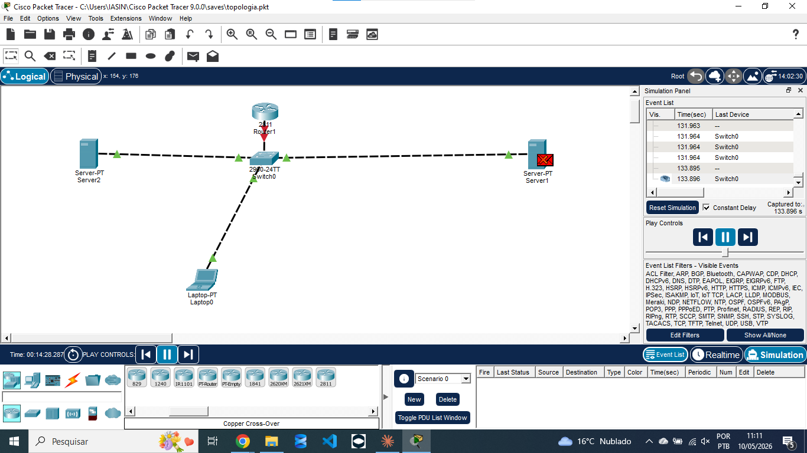

# Projeto 1 — Rede Básica com Servidor e Roteador

**Nível:** Básico  
**Status:** 🔄 Em andamento  
**Ferramenta:** Cisco Packet Tracer

---

## Topologia

---

## Dispositivos utilizados

| Dispositivo | Modelo | Função |
|---|---|---|
| Router1 | 2811 | Roteamento central |
| Switch0 | 2960-24TT | Comutação local |
| Server1 | Server-PT | Servidor principal |
| Server2 | Server-PT | Servidor secundário |
| Laptop0 | Laptop-PT | Cliente de teste |

---

## O que aprendi
- Conectar dispositivos via Switch
- Configurar IP estático
- Testar conectividade com ping
- Usar o modo Simulação para observar tráfego
